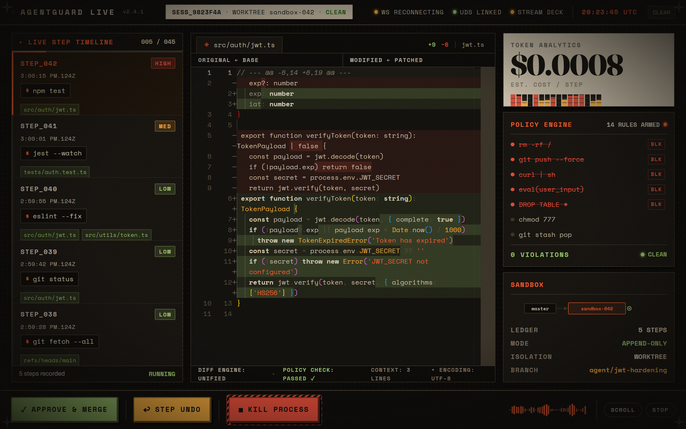
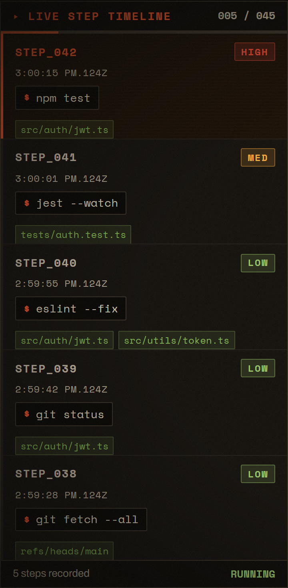
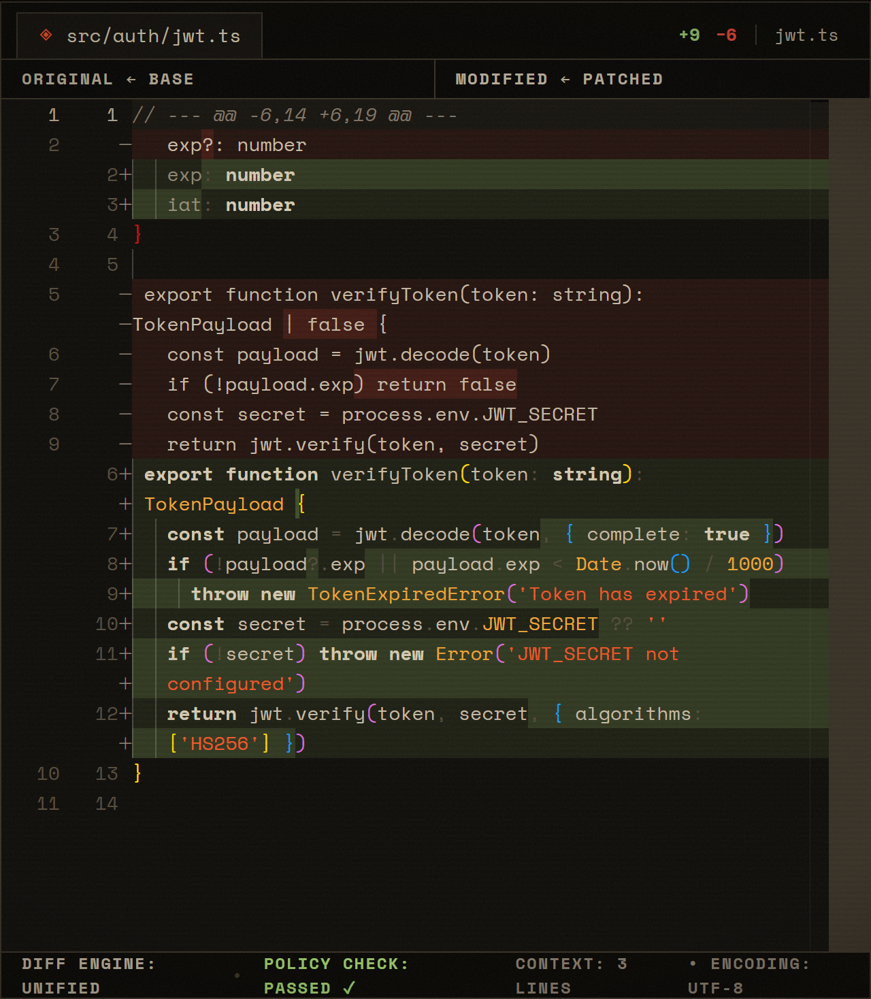
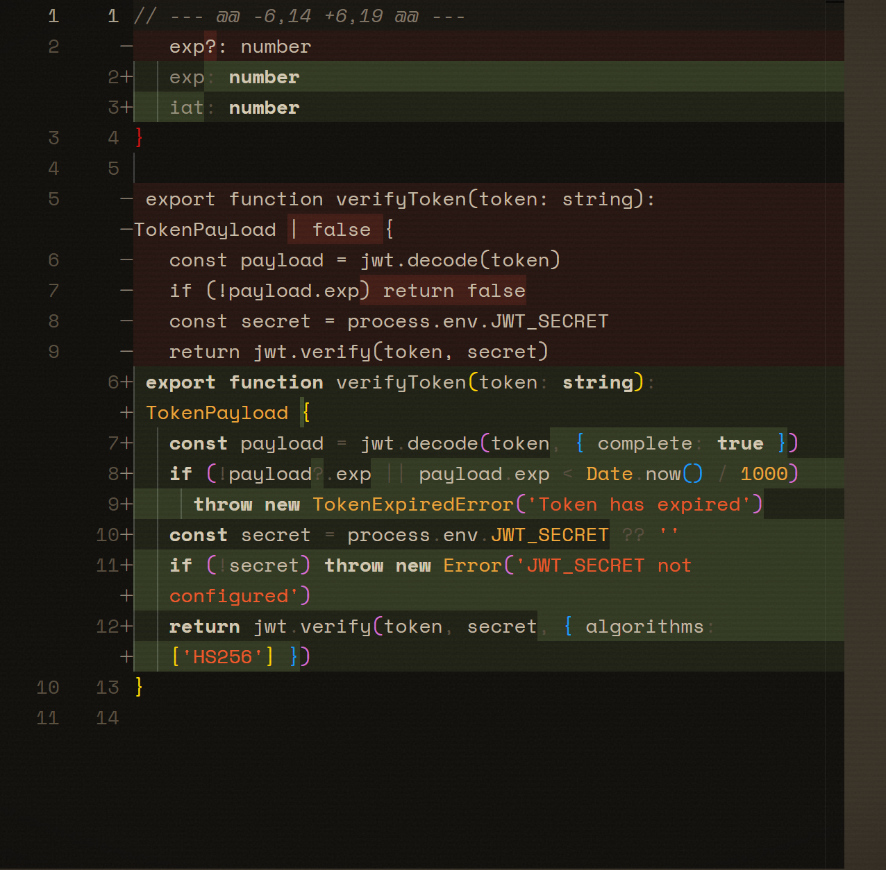
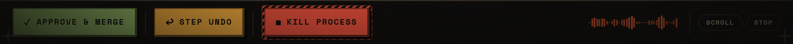

```text
   ▄▄▄       ▄████  ▓█████  ███▄    █ ▄▄▄█████▓ ▄████  █    ██  ▄▄▄       ██▀███  ▓█████▄
  ▒████▄    ██▒ ▀█▒ ▓█   ▀  ██ ▀█   █ ▓  ██▒ ▓▒██▒ ▀█▒ ██  ▓██▒▒████▄    ▓██ ▒ ██▒▒██▀ ██▌
  ▒██  ▀█▄ ▒██░▄▄▄░ ▒███   ▓██  ▀█ ██▒▒ ▓██░ ▒░██░▄▄▄░▓██  ▒██░▒██  ▀█▄  ▓██ ░▄█ ▒░██   █▌
  ░██▄▄▄▄██░▓█  ██▓ ▒▓█  ▄ ▓██▒  ▐▌██▒░ ▓██▓ ░░▓█  ██▓▓▓█  ░██░░██▄▄▄▄██ ▒██▀▀█▄  ░▓█▄   ▌
   ▓█   ▓██▒░▒▓███▀▒░▒████▒▒██░   ▓██░  ▒██▒ ░░▒▓███▀▒▒▒█████▓  ▓█   ▓██▒░██▓ ▒██▒░▒████▓ 
   ▒▒   ▓▒█░ ░▒   ▒ ░░ ▒░ ░░ ▒░   ▒ ▒   ▒ ░░   ░▒   ▒ ▒▒▓▒ ▒ ▒  ▒▒   ▓▒█░░ ▒▓ ░▒▓░ ▒▒▓  ▒ 
    ▒   ▒▒ ░  ░   ░  ░ ░  ░░ ░░   ░ ▒░    ░     ░   ░ ░ ▒░ ░ ░   ▒   ▒▒ ░  ░▒ ░ ▒░ ░ ▒  ▒ 
    ░   ▒   ░ ░   ░    ░      ░   ░ ░   ░      ░ ░   ░ ░ ░  ░ ░   ░   ▒     ░░   ░  ░ ░  ░ 
        ░  ░      ░    ░  ░         ░                ░   ░            ░  ░   ░        ░    
                                                                                        ░     
```

# 🛡️ AgentGuard Live
### The Mission-Control Cockpit & Security Sandbox for AI Coding Agents

[](https://opensource.org/licenses/MIT)
[](https://golang.org)
[](https://www.rust-lang.org)
[](https://tauri.app)
[](https://nodejs.org)

**AgentGuard Live** gives you total visibility and control over autonomous AI coding agents (like Claude Code, Cursor, and Windsurf). It intercepts their terminal commands, checks them against security rules, isolates all changes in temporary Git workspaces, and gives you a tactile cockpit to **review code diffs in real-time, approve changes, undo steps, or hit an emergency kill switch.**

---

## 📸 Cockpit Overview



---

## ✨ Why You Need AgentGuard Live

When AI agents write code on your machine, they run terminal commands, install packages, and edit files. Without a guardrail:
- ❌ A hallucinating agent can accidentally run `rm -rf /` or overwrite critical files.
- ❌ You have no real-time idea what files are being touched until after the damage is done.
- ❌ There is no instant "undo" button for a bad agent step.

**AgentGuard Live fixes this completely:**
- 🛡️ **Zero Risk**: All code runs in a sandboxed Git worktree (`sandbox-042`). Your main branch is untouched until you hit **[ APPROVE & MERGE ]**.
- 🚫 **Active Defense**: Blocks dangerous shell commands instantly before they execute.
- 👁️ **Live Code Diffs**: Side-by-Side Monaco diff viewer showing exactly what the AI changed.
- 💰 **Live Cost Tracking**: Real-time dollar estimate based on token velocity and context size.
- 🕹️ **Mechanical Control Deck**: Big tactile buttons to approve, rollback, or kill the agent process instantly.

---

## 🔍 Guided Tour of the Cockpit

### 1. Live Step Timeline & Risk Badges
The left panel tracks every step the AI proposes and runs. Each card shows the exact shell command, timestamps, and a color-coded **Risk Level** (`LOW`, `MED`, `HIGH`, `CRIT`).



- **Click any step**: Instantly loads its code changes into the center Monaco diff viewer.
- **Scanline highlight**: Shows the currently inspected active step with amber CRT scanlines.

---

### 2. Side-by-Side Code Diff Inspector
The center panel renders unified Git diffs using a custom brutalist dark theme.



- **Left Pane (`ORIGINAL ← BASE`)**: Clean baseline code before the AI touched it.
- **Right Pane (`MODIFIED ← PATCHED`)**: Proposed patch in the sandbox.
- **Additions / Deletions**: Clear `+12` (green) and `−4` (red) counters and syntax coloring.

---

### 3. Telemetry, Policy Engine & Sandbox Status
The right column stacks three mission-critical telemetry widgets:



1. **Token Analytics (Warm Paper Card)**:
   - Giant `$0.0042` estimated cost per step in serif typography.
   - 16-bar animated VU-meter reacting to agent activity in real-time.
   - Live token context and velocity counter (`CTX 14,200 TOK • VEL 320 TOK/S`).
2. **Policy Engine (Armed Security Rules)**:
   - 14 active regex security rules.
   - Malicious commands (`rm -rf /`, `git push --force`, `curl | sh`, `DROP TABLE *`) are struck through with red `BLK` badges.
   - Status badge shows `0 VIOLATIONS • CLEAN`.
3. **Sandbox Node**:
   - Visual branch topology (`master ➔ sandbox-042`).
   - Append-only ledger step count and worktree isolation status.

---

### 4. Hardware Keycap Control Deck
The bottom deck features heavy 3D physical keycap buttons with mechanical press travel:



- **`[ ✓ APPROVE & MERGE ]` (Green)**: Merges the sandboxed Git worktree into your main branch.
- **`[ ↩ STEP UNDO ]` (Amber)**: Rolls back the last step in the sandbox without affecting previous work.
- **`[ ■ KILL PROCESS ]` (Red with Hazard Stripes)**: Emergency panic button sending `SIGTERM` to halt the runtime immediately.
- **Waveform Visualizer**: 36-bar dynamic event throughput monitor.

---

## 🚀 1-Minute Quick Start

### Prerequisites
- [Docker & Docker Compose](https://www.docker.com/) (Optional for full container stack)
- [Node.js 18+](https://nodejs.org/)

### Start the Dashboard & Tunnel
```bash
# 1. Clone the repository
git clone https://github.com/agentguard/agentguard-live.git
cd agentguard-live

# 2. Start the MCP Tunnel in Terminal 1
node extensions/mcp-tunnel/start.js --port 9000

# 3. Start the UI in Terminal 2
cd ui && npm run dev
```

Open your browser to:
👉 **`http://localhost:5173/`** (or `http://localhost:5174/` if 5173 is occupied)

---

## 🛠️ Step-by-Step Configuration Guide (IDE Setup)

AgentGuard Live communicates with AI coding assistants (Antigravity, Cursor, Claude Desktop, VS Code/Cline) via the **Model Context Protocol (MCP)**. Follow the steps below for your tool:

### 1. Antigravity IDE Setup
Add the `agentguard` server entry to your global config file at `C:\Users\<User>\.gemini\config\mcp_config.json` (or `.agents/mcp_config.json` in your workspace):

```json
{
  "mcpServers": {
    "agentguard": {
      "command": "node",
      "args": [
        "c:/path/to/agentguard-live/extensions/mcp-tunnel/start.js",
        "--port",
        "9000",
        "--host",
        "127.0.0.1"
      ],
      "env": {
        "AGENTGUARD_MCP_SECRET": "agentguard_master_secret_key_32b"
      }
    }
  }
}
```

---

### 2. Cursor IDE Setup
1. Open Cursor Settings (`Ctrl + Shift + J` or `Cmd + Shift + J`).
2. Navigate to **Features ➔ MCP Servers ➔ Add New MCP Server**.
3. Fill in:
   - **Name**: `agentguard`
   - **Type**: `command`
   - **Command**: `node "c:/path/to/agentguard-live/extensions/mcp-tunnel/start.js" --port 9000`
4. Or directly edit `~/.cursor/mcp.json`:
```json
{
  "mcpServers": {
    "agentguard": {
      "command": "node",
      "args": [
        "c:/path/to/agentguard-live/extensions/mcp-tunnel/start.js",
        "--port",
        "9000"
      ]
    }
  }
}
```

---

### 3. Claude Desktop Setup
Open your Claude Desktop configuration file:
- **Windows**: `%APPDATA%\Claude\claude_desktop_config.json`
- **macOS**: `~/Library/Application Support/Claude/claude_desktop_config.json`

Add the following under `"mcpServers"`:
```json
{
  "mcpServers": {
    "agentguard": {
      "command": "node",
      "args": [
        "/absolute/path/to/agentguard-live/extensions/mcp-tunnel/start.js",
        "--port",
        "9000",
        "--host",
        "127.0.0.1"
      ],
      "env": {
        "AGENTGUARD_MCP_SECRET": "agentguard_master_secret_key_32b"
      }
    }
  }
}
```

---

### 4. How to Test the Connection

Once configured, test the tools by prompting your AI assistant:

| Action | Example Prompt to AI | What AgentGuard Does |
|---|---|---|
| **Read file in sandbox** | *"Use AgentGuard to read `src/auth/jwt.ts`."* | Reads the file safely from `sandbox-042` with path-traversal prevention. |
| **List sandbox tree** | *"List the workspace files using AgentGuard."* | Returns the directory structure of the isolated worktree. |
| **Inspect ledger** | *"Inspect the security ledger state."* | Returns active rules (`14 RULES ARMED`), mode, and session ID. |

---

## 📚 Built-in Documentation Scraper (Ketch)

AI agents frequently need fresh documentation. AgentGuard includes a built-in headless scraper ported from `1broseidon/ketch`:

```bash
# Fetch any documentation URL and output clean Markdown
agentguard-bar fetch-docs https://docs.rs/tokio/latest/tokio/
```
The scraper automatically converts HTML to Markdown, strips scripts and ads, enforces a 2MB memory cap, and broadcasts a `CONTEXT_FETCHED` event to the dashboard.

---

## 🏗️ System Architecture

```text
  ┌─────────────────────────────────────────────────────────────┐
  │                 Autonomous AI Coding Agent                  │
  │               (Claude Code / Cursor / Windsurf)             │
  └──────────────────────────────┬──────────────────────────────┘
                                 │
                 CLI Interception / MCP Protocol
                                 ▼
  ┌─────────────────────────────────────────────────────────────┐
  │         AgentGuard Blade Agent Runtime (BAR) Daemon         │
  │                     (Go 1.22 Daemon)                        │
  ├─────────────────────────────────────────────────────────────┤
  │  • Regex Security Policy Engine (Blocks dangerous commands) │
  │  • Ephemeral Git Worktree Isolation (sandbox-042)           │
  │  • Append-Only State Ledger (ledger.jsonl)                  │
  │  • Ketch Documentation Scraper (extensions/docs-scraper)    │
  └──────────────────────────────┬──────────────────────────────┘
                                 │
                   Unix Domain Socket (JSONL)
                   /tmp/agentguard.sock
                                 ▼
  ┌─────────────────────────────────────────────────────────────┐
  │            Telemetry & Dispatch Nervous System              │
  │                     (Rust 1.77 Axum)                        │
  ├─────────────────────────────────────────────────────────────┤
  │  • High-throughput broadcast channel (tokio::sync::broadcast)│
  │  • Real-time token velocity & $ USD cost aggregation        │
  │  • Stream Deck & Physical Panic Button hardware hooks       │
  └───────────────┬─────────────────────────────┬───────────────┘
                  │                             │
       WebSocket (Port 8765)         MCP Loopback (Port 9000)
                  ▼                             ▼
  ┌──────────────────────────────┐┌─────────────────────────────┐
  │    AgentGuard Cockpit UI     ││     Exeora MCP Tunnel       │
  │ (Tauri v2 + React 18 + Vite) ││   (Node.js 20 + JSON-RPC)   │
  ├──────────────────────────────┤├─────────────────────────────┤
  │ • Mission-Control Brutalist  ││ • Encrypted Local Loopback  │
  │ • Live Step Timeline Cards   ││ • read_sandbox_file         │
  │ • Side-by-Side Monaco Diff   ││ • list_sandbox_tree         │
  │ • Paper Token Analytics      ││ • inspect_ledger            │
  │ • 3D Hardware Keycap Deck    ││                             │
  └──────────────────────────────┘└─────────────────────────────┘
```

---

## 🛠️ Master Build Commands (`Makefile`)

| Command | Description |
|---|---|
| `make dev` | Spins up the Docker backend and starts the local Vite dev server |
| `make build-backend` | Compiles native Go and Rust binaries to `./bin/` |
| `make build-ui` | Compiles the React bundle and packages the Tauri desktop application |
| `make build-all` | Compiles the complete full-stack monorepo |
| `make test` | Runs the test suites across Go, Rust, and TypeScript |
| `make clean` | Tears down containers and wipes build artifacts |

---

## 📄 License
MIT © 2026 AgentGuard Contributors.
